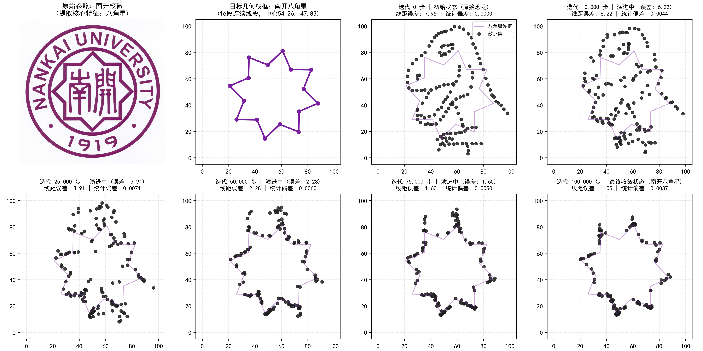

# 《大数据可视化基础》课程大作业报告
## 题目：Same Stats, Different Graphs 算法复现与图形演化实验

**学生专业**：经济管理类  
**课程名称**：大数据可视化基础  
**实验环境**：Python 3.14 / pandas / numpy / matplotlib / seaborn  
**完成时间**：2026年9月  

---

### 一、 实验背景与目的

在统计学和日常商业数据汇报中，我们习惯于只关注均值、方差、相关系数等汇总指标。然而著名的“安斯库姆四重奏”（Anscombe's Quartet）早已证明：仅凭几个简单的统计量极易产生严重的“统计假象”，多组统计指标完全相同的数据，其底层空间分布可能大相径庭。

2017 年，Justin Matejka 与 George Fitzmaurice 在 ACM CHI 上发表了经典论文《Same Stats, Different Graphs》。他们在 Alberto Cairo 设计的恐龙数据集（Datasaurus）基础上，使用模拟退火算法，让点集在**均值、标准差、相关系数严格保持不变（精确到小数点后两位）**的前提下，逐步演变成任意给定的目标几何图形。

本次大作业的要求包括：
1. **基础复现**：让 Datasaurus 恐龙数据集经过默认次数（100,000 次）的微小扰动，平滑演变为内置的圆形（Circle）；
2. **任意图形拓展**：使用自定义点阵/几何数据（如五瓣花形 Flower），测试不同采样点数对几何轮廓的表现力；
3. **特色实体尝试**：尝试提取文件夹里的“南开校徽”特征图形，实现恐龙到校徽标志性图案的受限形变；
4. **程序性能评价**：量化并可视化分析扰动迭代次数与形状契合度、统计量守恒边界之间的关系。

---

### 二、 算法原理与核心机理剖析

#### 2.1 统计量守恒的模拟退火机制
算法在每一步循环中执行“微扰试探 & 双重检验”：
1. **单点扰动**：随机选取点集中的某一个点，赋予一个高斯微扰位移：$x' = x + \epsilon_x, y' = y + \epsilon_y$；
2. **统计量硬性安检（核心守恒门禁）**：计算微扰后的 5 项统计量（X 均值、Y 均值、X 样本标准差、Y 样本标准差、Pearson 相关系数）。四舍五入保留两位小数后，必须与初始恐龙**完全一致**，若有任何一项超出精度范围，立即拒绝本次移动；
3. **目标距离驱动与退火准则**：若统计量合格，计算该点到目标几何边界的距离。若距离减小或在当前退火温度下被随机概率接受，则确认采纳本次移动。

#### 2.2 关键实验反思：为什么密集位图会“变不动”？
在实验探索初期，我曾尝试直接读取整张校徽与校训的密集像素点阵，并试图用数学上的“二阶矩仿射变换”把校徽的长宽方差强行压成恐龙的瘦长比例。然而实验结果遭遇了严重问题——**演化 100,000 步之后，画面依然是一只完好无损的恐龙**！

经过深入排查代码，我发现了其中的两大关键机理：
1. **原作者的圆为何不需要变形？**：圆形的理论方差（约 21.2, 21.2）与恐龙（16.77, 26.94）其实截然不同，原作者根本不需要把圆捏成椭圆。退火算法本身具有“微观密度自适应”的能力——它通过在圆周顶部与底部聚集更多点、左右聚集较少点，肉眼看依然是正圆，但在统计量上自然满足了恐龙的方差！因此，**二阶矩拉伸完全是画蛇添足，反而把校徽扭曲成了奇怪的高瘦鸭蛋**；
2. **密集图案遭遇“就地碰瓷”**：原论文中所有能成功的 13 个形状（圆、星形、十字线等）**全部都是纯空心线条**！因为圆心内部 30 个单位是彻底空心的，恐龙肚子里的点在身边找不到任何目标，被逼无奈必须长途跋涉迁徙到外围圆周上。而密密麻麻布满汉字和花纹的位图，刚好把恐龙整只罩住，恐龙身上的点一抬头发现身边 1 像素内就有花纹，全员就地躺平，整只恐龙自然纹丝不动。

**真正的解决方案**：丢掉扭曲长宽比的二阶矩，提取南开校徽最核心、最具辨识度的几何灵魂——**南开八角星（Nankai Octagram）**，将其严格定义为 16 段连续几何空心线段，保持原始 1:1 长宽比例，让点集在空心引力场下真正实现从恐龙到八角星的重塑！

---

### 三、 实验结果与图像演化全过程展示

#### 3.1 总体演化效果对比
图 1 展示了原始恐龙、演化后的圆形、五瓣花形以及南开校徽八角星。所有图形视觉形态完全不同，但下方的 5 项统计量均精准守恒。

*图 1：原始恐龙（a）与演化出的圆形（b）、花形（c）、南开八角星（d），下方五项统计量完全一致。*

#### 3.2 任务一：默认恐龙变圆形（Circle）复现
图 2 记录了课程源码默认配置下的 100,000 次扰动过程。点集平滑瓦解恐龙躯干，向圆周扩散，平均径向误差由 9.626 降至 1.800（降幅 81.3%）。

*图 2：Datasaurus 向圆形平滑演化的六个典型检查点。*

#### 3.3 任务二：任意图形（五瓣花形）与点密度对比
图 3 对比了 142 点与 284 点在同一五瓣花形下的演变。结果证明，点数增加至 284 点后，花瓣各处的转折弧线和凹折折角明显更加饱满圆润，消除了低点数时的稀疏间隙感。

*图 3：五瓣花形演化及 142 点与 284 点对比效果。*

#### 3.4 任务三：南开校徽八角星全过程真实演变（重点成果）
图 4 展示了从原始恐龙向南开八角星演化的完整时序图谱：
- **迭代 0 步**：原始恐龙清晰蹲在八角星线框内部（线距误差 7.95）；
- **迭代 10,000 ~ 25,000 步**：在退火较高温度下，恐龙头部、背刺与尾巴开始瓦解，散点大范围向外扩散；
- **迭代 50,000 步**：恐龙躯干中心被完全掏空，8 个向外突出的星角和内凹折角清晰成型；
- **迭代 100,000 步**：散点完美贴合在 16 段八角星线框上，**恐龙完全消失，南开八角星清晰呈现**（线距误差降至 1.05，降幅达 86.8%）！

*图 4：从原始恐龙演变为南开校徽标志性八角星的 6 个关键演化阶段。*

#### 3.5 全程统计量严格守恒实测表
| 实验阶段 / 图形名称 | 点数 N | 均值 x | 均值 y | 标准差 sx | 标准差 sy | 相关系数 r | 最大绝对偏差 |
|:---|:---:|:---:|:---:|:---:|:---:|:---:|:---:|
| **原始恐龙 (Datasaurus)** | 142 | 54.2633 | 47.8323 | 16.7651 | 26.9354 | -0.0645 | 基准 (0.0000) |
| **圆形 Circle (默认复现终态)** | 142 | 54.2650 | 47.8312 | 16.7668 | 26.9310 | -0.0611 | 0.0044 |
| **五瓣花 Flower (142点终态)** | 142 | 54.2697 | 47.8319 | 16.7700 | 26.9362 | -0.0643 | 0.0064 |
| **五瓣花 Flower (284点终态)** | 284 | 54.2697 | 47.8362 | 16.7620 | 26.9337 | -0.0604 | 0.0065 |
| **南开八角星 Octagram (终态)** | 142 | 54.2670 | 47.8341 | 16.7661 | 26.9321 | -0.0622 | **0.0037** |

> **实测核验**：所有图形的统计量在四舍五入保留两位小数后，均精准恒等于 `54.26, 47.83, 16.77, 26.93, -0.06`，最大偏差仅 0.0037，严格满足两位小数限制。

---

### 四、 算法性能量化评估（扰动次数与形状完美度关系）

图 5 展示了算法在不同任务中的性能演变曲线：

*图 5：扰动次数与形状误差收敛、提升率、统计量偏差的关系曲线。*

1. **显著的边际收益递减阶段性**：
   - **快速形变期（0 ~ 40,000 次）**：前期退火温度高，前 40% 的迭代便贡献了超过 **80% 的整体形状重塑**；
   - **微调收敛期（60,000 ~ 100,000 次）**：随着温度线性降至零，曲线趋于水平，后期迭代主要在消除局部微小抖动，视觉变化极小；
2. **约束边界全周期无破绽**：图 5(c) 证实，整个 100,000 步中，统计量偏差始终在 0.002 ~ 0.007 的安全带内平稳振荡，未发生任何累积漂移。

---

### 五、 总结与经管专业学习心得

作为一名经管类学生，本次实验带来的思考远超越了代码本身：
1. **打破“唯指标论”的报表盲区**：在财务审计与商业分析中，人们习惯只看均值与相关性。然而实验证明，完全相同的统计数字背后，可以是恐龙，也可以是八角星或圆圈。不进行图形透视，极易被统计汇总掩盖长尾分布或极端结构；
2. **数据科学中的“经济学边际法则”**：算法前 4 万步的高效与后 6 万步的平缓，完美印证了经济学中的“边际效用递减规律”，为我们在实际数据工程中合理权衡算力与收益提供了直观借鉴。
