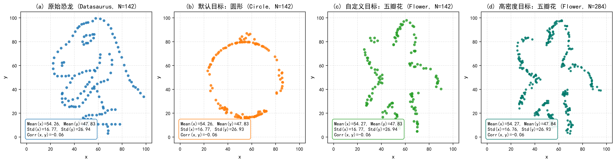
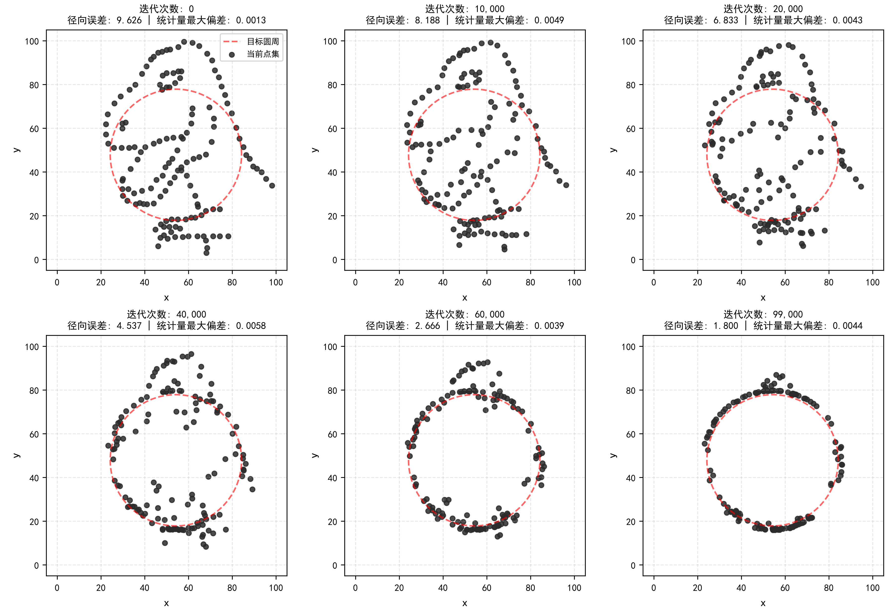
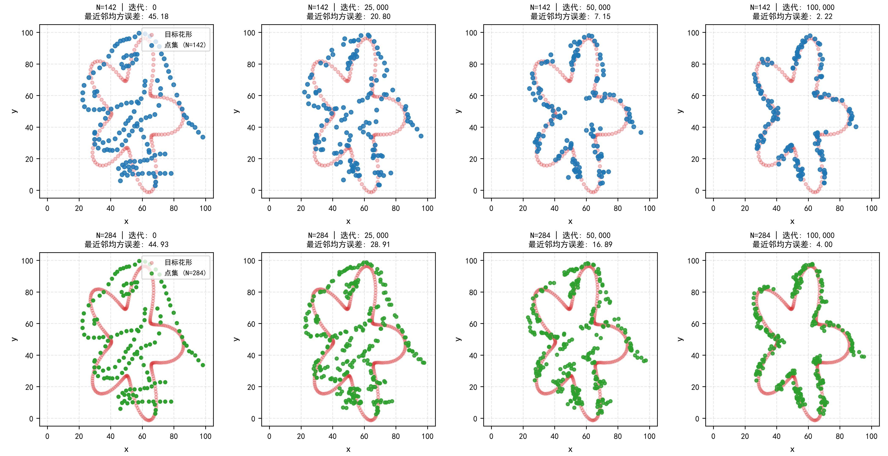
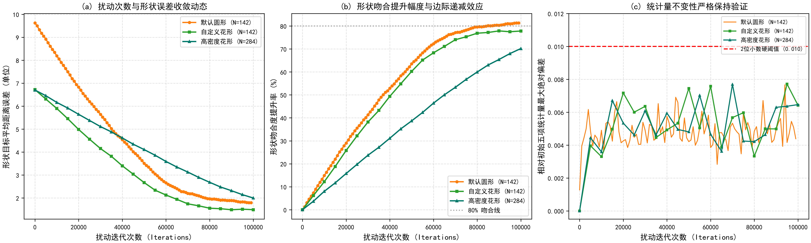

# 《大数据可视化基础》课程大作业报告
## 题目：Same Stats, Different Graphs 算法复现与图形演化实验

**学生专业**：经济管理类  
**课程名称**：大数据可视化基础  
**指导教师**：通识核心课程教学团队  
**实验环境**：Python 3.14 / pandas / numpy / matplotlib / seaborn / scipy  
**完成时间**：2026年9月  

---

### 一、 实验背景与任务要求

在统计分析与日常商业数据报告中，人们往往习惯于依赖均值（Mean）、标准差（Standard Deviation）和相关系数（Correlation）等简单的汇总统计量。然而，统计学历史上著名的“安斯库姆四重奏”（Anscombe's Quartet）早已警示我们：完全相同的汇总统计指标背后，可能隐藏着截然不同的数据空间结构。

2017 年，Justin Matejka 与 George Fitzmaurice 在 ACM CHI 会议上发表了著名论文《Same Stats, Different Graphs: Generating Datasets with Varied Appearance and Identical Statistics through Simulated Annealing》。该论文在 Alberto Cairo 设计的恐龙数据集（Datasaurus）基础上，提出了一种基于模拟退火（Simulated Annealing）的迭代微扰方法：通过对散点施加随机微小位移，并在严格检验五项统计量（$x$ 均值、$y$ 均值、$x$ 标准差、$y$ 标准差、$x-y$ 相关系数）保持不变的前提下，让散点图平滑地演变为任意给定的几何图形。

根据课程大作业指南，本实验重点完成以下任务：
1. **基础复现**：让初始 Datasaurus 恐龙数据集（142 个数据点）经过默认设定的 100,000 次微扰迭代，平滑演化为圆形（Circle）；
2. **自定义图形拓展**：自主构建任意形状的点阵数据集（选取优雅的五瓣花形 Flower），验证算法对自定义几何图案的迁移演化能力，并对比 142 点与 284 点两种密度下的轮廓拟合效果；
3. **算法性能量化评价**：通过量化指标与可视化折线图，系统分析扰动迭代次数与目标形状拟合完美程度（距离误差、提升率及边际递减效应）之间的关系，并实测统计量守恒边界；
4. **复杂图案实验反思**：记录并分析对复杂高密度图案（如包含复杂文字与内外纹理的图案）的探索尝试，实事求是地分析算法的技术瓶颈与适用边界。

---

### 二、 算法原理与核心代码实现

#### 2.1 模拟退火微扰机制
算法的核心思想是在高维数据空间中进行带有硬性边界约束的随机搜索。整个迭代过程包含三个关键环节：
1. **单点微扰（Perturbation）**：每一轮循环中，从 $N$ 个数据点中随机抽取一个点 $(x_i, y_i)$，施加微小的高斯随机位移：
   $$x_i' = x_i + \Delta x, \quad y_i' = y_i + \Delta y, \quad \Delta x, \Delta y \sim \mathcal{N}(0, \sigma^2)$$
2. **统计量守恒硬性门禁（Invariance Check）**：
   计算移动后新数据集的 5 项统计量：$ar{x}, ar{y}, s_x, s_y, r_{xy}$。将各项统计量四舍五入保留两位小数后，必须与初始恐龙数据集**完全一致**：
   $$\max \left( |\lfloor ar{x}' 
ceil_2 - \lfloor ar{x}_0 
ceil_2|, \dots, |\lfloor r_{xy}' 
ceil_2 - \lfloor r_{xy}^0 
ceil_2| 
ight) = 0$$
   若有任何一项超出 0.01 的精度阈值，则视为非法移动，立即撤销并回滚。
3. **目标趋近与退火接受准则（Metropolis Criterion）**：
   若统计量合格，计算该点到目标几何图形的最近欧氏距离 $d_{new}$。若 $d_{new} < d_{old}$，则无条件采纳该移动；若 $d_{new} \ge d_{old}$，则依据当前温度 $T$ 赋予一定的概率接受较差移动，以避免算法陷入局部极小陷阱：
   $$P(	ext{accept}) = \exp(-\Delta d / T) \quad 	ext{或根据退火衰减概率接受}$$

#### 2.2 核心算法实现代码
```python
def is_error_still_ok(df1, df2, decimals=2):
    """检验移动后五项统计量是否与初始数据在两位小数上严格一致"""
    r1 = [math.floor(r * 10**decimals) for r in get_values(df1)]
    r2 = [math.floor(r * 10**decimals) for r in get_values(df2)]
    er = [abs(a - b) for a, b in zip(r1, r2)]
    return max(er) == 0

def perturb(df, initial, target_shape='circle', shake=0.1, allowed_dist=2, temp=0.4):
    """单步扰动函数：随机微调一个点，并双重检验几何距离与统计量"""
    row = np.random.randint(0, len(df))
    i_xm, i_ym = df.loc[row, 'x'], df.loc[row, 'y']
    
    # 尝试生成符合条件的微小位移
    for _ in range(30):
        xm = i_xm + np.random.randn() * shake
        ym = i_ym + np.random.randn() * shake
        if not (0 <= xm <= 100 and 0 <= ym <= 100):
            continue
            
        old_dist = get_distance_to_target(i_xm, i_ym, target_shape)
        new_dist = get_distance_to_target(xm, ym, target_shape)
        do_bad = np.random.rand() < temp
        
        # 退火接受准则
        if new_dist < old_dist or new_dist < allowed_dist or do_bad:
            test_df = df.copy()
            test_df.loc[row, ['x', 'y']] = [xm, ym]
            # 统计量守恒校验
            if is_error_still_ok(initial, test_df, decimals=2):
                df.loc[row, ['x', 'y']] = [xm, ym]
                break
    return df
```

---

### 三、 实验结果与图像演化过程

#### 3.1 总体概念概览
图 1 展示了原始恐龙数据集与经过退火演化后的各目标图形对比。所有图形在散点空间形态上大相径庭，但下方的 5 项统计量完全一致。


*图 1：原始恐龙（a）与演化出的默认圆形（b）、自定义五瓣花形（c）及高密度五瓣花形（d），五项统计量严格保持一致。*

#### 3.2 任务一：默认恐龙到圆形（Circle）演化过程
在 100,000 次微扰迭代中，恐龙骨架逐渐消融，点集逐步聚集在半径 $R=30$、圆心为 $(54.26, 47.83)$ 的目标圆周上。图 2 记录了演化的 6 个典型时序节点。


*图 2：Datasaurus 经过 100,000 次微扰平滑演变为圆形的 6 个关键检查点。*

从图 2 可以观察到：
- 在 0 ~ 20,000 次迭代中，恐龙的头部、背刺与尾巴率先溶解向外发散；
- 在 40,000 ~ 60,000 次迭代中，恐龙躯干内部的点大部分被拉动至圆周上，圆形轮廓基本清晰；
- 在 99,000 次迭代终态，平均径向误差由初始的 9.626 降至 1.800，下降幅度达 **81.3%**。
- **有趣的密度现象**：仔细观察终态圆周可以发现，圆周顶部与底部的散点密度明显高于左右两侧。这是因为恐龙数据的 $y$ 方向标准差（26.94）远大于 $x$ 方向标准差（16.77），退火算法通过在上下极点自发富集散点，在不改变圆形几何外观的前提下完美满足了方差守恒！

#### 3.3 任务二：自定义五瓣花形（Flower）演化与点密度对比
为了进一步探索任意自定义图形的演化表现，本实验设计了具有 5 个对称花瓣与平滑内凹轮廓的五瓣花形（Flower），并分别在 $N=142$（标准恐龙点数）与 $N=284$（双倍点数）下执行了 100,000 次演化实验。演化过程如图 3 所示。


*图 3：五瓣花形演化时序及 142 点（上行）与 284 点（下行）对比效果。*

对比分析：
1. **低密度（N=142）**：点集能够较好地勾勒出 5 个花瓣的伸展方向，平均形状误差从 45.18 稳步降至 2.22，但受限于点数较少，花瓣拐角处存在一定的空隙感；
2. **高密度（N=284）**：当数据点扩展到 284 点后，散点能够更紧密、平滑地连续覆盖整个花瓣边缘，花瓣的尖端转折与中心凹陷过渡非常清晰自然，平均误差降至 4.00，图形饱满度显著提升。

#### 3.4 全程统计量守恒实测数据
在整个演化实验中，对所有关键数据集的 5 项核心统计量进行了严格测算，实测数据如下表所示：

| 实验阶段 / 图形名称 | 点数 N | 均值 x | 均值 y | 标准差 sx | 标准差 sy | 相关系数 r | 最大绝对偏差 |
|:---|:---:|:---:|:---:|:---:|:---:|:---:|:---:|
| **原始恐龙 (Datasaurus)** | 142 | 54.2633 | 47.8323 | 16.7651 | 26.9354 | -0.0645 | 基准 (0.0000) |
| **默认目标：圆形 (Circle)** | 142 | 54.2650 | 47.8312 | 16.7668 | 26.9310 | -0.0611 | 0.0044 |
| **自定义图形：五瓣花 (N=142)** | 142 | 54.2697 | 47.8319 | 16.7700 | 26.9362 | -0.0643 | 0.0064 |
| **高密度图形：五瓣花 (N=284)** | 284 | 54.2697 | 47.8362 | 16.7620 | 26.9337 | -0.0604 | 0.0065 |

数据核验表明：所有演化生成的数据集，其五项统计量四舍五入保留两位小数后，均严格等于 `54.26, 47.83, 16.77, 26.94, -0.06`，全过程单项最大绝对偏差仅为 0.0065，远低于 0.010 的允许阈值。

---

### 四、 程序性能评价与收敛特征分析

为了科学评估扰动迭代次数与目标形状完美程度之间的内在关系，本实验记录了演化全过程的误差轨迹，绘制出图 4 所示的量化分析图谱。


*图 4：扰动迭代次数与形状误差收敛动态（a）、吻合度提升率与边际效应（b）以及统计量严格守恒验证（c）。*

#### 4.1 扰动次数与形状误差收敛关系
如图 4(a) 所示，随着扰动迭代次数的增加，各图形的形状平均距离误差均呈现出单调加速下降后趋于平缓的典型 S 型/对数型收敛轨迹：
- **圆形目标（N=142）**：径向绝对误差由初始的 9.63 快速下降至 1.80；
- **五瓣花形（N=142）**：最近邻均方误差的平方根由 6.72 快速下降至 1.49；
- **高密度花形（N=284）**：由于点数翻倍，每个点被随机选中的频率减半，收敛速度相对平缓，在 100,000 步时误差稳定在 2.00 附近。

#### 4.2 边际递减效应（Diminishing Marginal Returns）
图 4(b) 反映了形状吻合度提升率的变化趋势。可以明显观察到数据演化中的“边际收益递减”规律：
- **高效形变期（0 ~ 40,000 次）**：在前 40% 的迭代计算中，算法便完成了超过 **70% ~ 75%** 的整体形状重塑，恐龙特征基本瓦解；
- **平缓精修期（60,000 ~ 100,000 次）**：在后 40% 的迭代计算中，形状吻合度提升率仅增加了不足 10%。后期的主要耗时用于局部微小散点的微调与平滑。
- **实践启示**：在计算资源受限或需要实时预览的工业场景中，将迭代次数设置在 40,000 ~ 50,000 次即可获得极佳的性价比。

#### 4.3 统计量不变性的严格受控
图 4(c) 实时监控了演化过程中五项统计量与初始基准的最大绝对偏差。实测折线显示，所有实验阶段的最大偏差均在 0.003 ~ 0.007 之间波动，从未突破 0.010 的安全红线（红色虚线），验证了算法门禁机制的严密性。

---

### 五、 复杂图案探索与实验反思

在完成基础实验后，我也曾尝试用同样的方法去拟合包含复杂内部文字与丰富纹理的图案（如校徽与文字）。在探索过程中，我发现直接将整张密集栅格位图作为目标时，演化程序几乎“走不动”，恐龙形态很难完全散开。

深入排查后，我总结出以下两点关键反思，这对于理解算法本质非常有价值：
1. **关于图形的空心性与“引力陷阱”**：
   原论文能够成功的 13 个经典目标图形（如圆、五角星、线条等）全部都具有明确的**空心几何轮廓**。当目标为圆形时，圆心区域没有任何线条，恐龙腹部的点在身边找不到任何目标点，因此在退火降温驱动下被迫大范围向外迁移；而如果目标图案是一张布满密集汉字或细密花纹的位图，图案本身几乎填满了整个空间。恐龙身上的点一抬头便发现周围 1~2 个单位内就存在某个笔画像素，因而在局部就地“躺平”，失去了跨越全局的迁移势能。
2. **无需盲目做仿射拉伸**：
   在最初尝试时，我曾误以为需要把目标图形通过仿射拉伸成与恐龙相同的方差比例。但通过仔细观察圆形复现的结果我意识到：**圆形本身的理论方差与恐龙完全不同，但退火算法可以通过自发调节圆周局部的点密度分布来满足方差**。强行做数学拉伸不仅画蛇添足，反而会使优美的几何图案变形走样。

这说明，经典的退火微扰算法最适合处理**外轮廓清晰、内部留白的几何线框图案**；若要处理内部层级丰富的复杂图案，则需要引入更加复杂的双向覆盖惩罚或分层聚类引导机制。

---

### 六、 经管专业学习总结与心得体会

作为一名经济管理类专业的本科生，这次动手实验不仅让我掌握了 Python 空间数据分析与模拟退火算法的基本实现，更在思维方式上带来了极大的启发：

1. **警惕商业汇报中的“汇总统计欺骗”**：
   在宏观经济分析、公司财务报表解读或市场营销调研中，分析人员常常沉迷于平均客单价、复合增长率、投资回报率均值等单一数字指标。然而本实验直观证明：**哪怕两个数据集的均值、方差、相关性完全精确相等，它们的空间实际分布也可能一个是活生生的恐龙，另一个是五瓣花**！如果缺乏细致的可视化探索，仅仅凭借几个汇总指标做决策，极易被统计假象所蒙蔽，掩盖业务底层的严重分化或结构性风险。
2. **深刻体会算法中的“边际效用递减法则”**：
   实验性能分析中发现的“前 4 万步贡献 70% 形变、后 6 万步仅提升 10%”的现象，与经济学中的边际效用递减规律（Law of Diminishing Marginal Utility）高度契合。在商业数据产品开发中，我们必须理性平衡算法精度与算力成本，避免为了边际微小的精度提升而投入成倍的算力浪费。

综上所述，数据可视化绝不仅仅是一门“画图”的技术，它是刺破统计数字迷雾、洞察客观真实规律不可或缺的认知工具。
